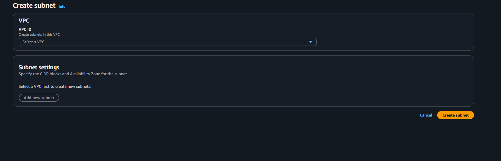
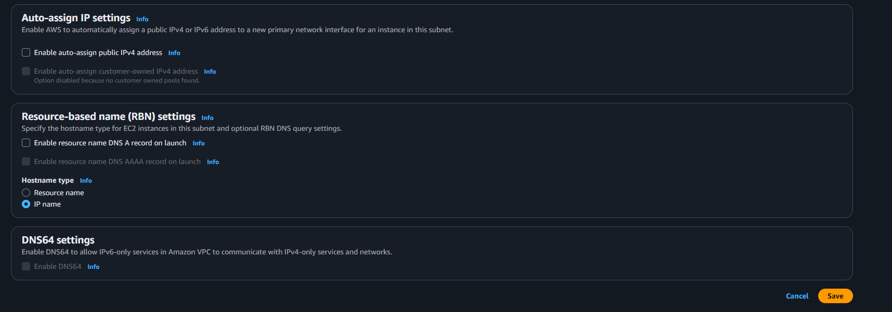
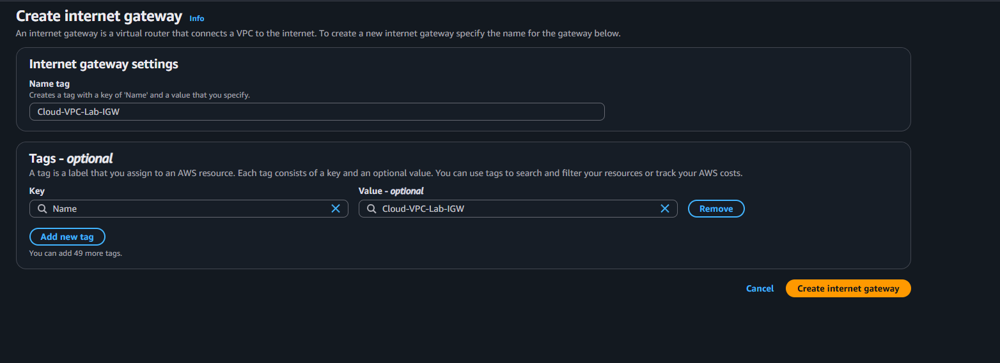
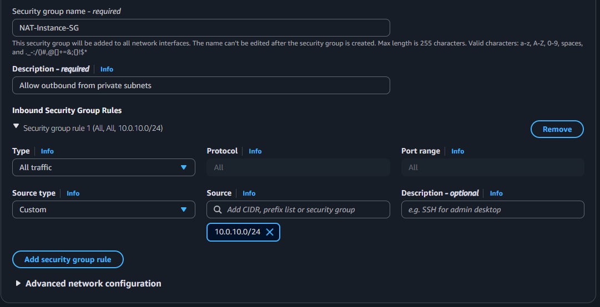
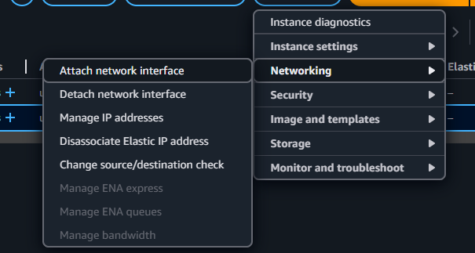
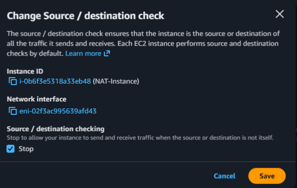
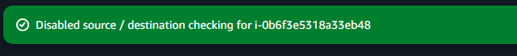

# aws-cloud-vpc-lab

Cloud networking is an important skill to have since many companies are shifting from on prem to to the cloud and knowing cloud architecture and networking helps with that.

# VPC

The first step is to to the VPC page in AWS and when there click on the create VPC button, then see this:   
    
Make sure to have the option as VPC only, then name it something like "Cloud-VPC-Lab". Then for the IPv4 CIDR put 10.0.0.0/16, turn on IPv4 CIDR, keep tenancy to default and then click on create. After a second, the VPC should be up.   
Then click on the actions tab and click on Edit VPC settings and see this:  
   
Then click on enable DNS hostnames and click on save.

# Subnets

After saving, go the left side of the page and click on subnets page and then click on Create a Subnet and see this:    
  
For VPC ID choose the one where the lab was created and then go create the settings for the public one. 
Name the first subnet "Public-Subnet-1A", then for availablity zone pick either no preferance or us-east-1a and for the IPv4 Subnet CIDR block name it 10.0.1.0/24, then click on add to a subnet.   
For the second subnet, name it "Private-Subnet-1A", then for avaiablity zone choose us-east-1b, then for IPv4 subnet choose 10.0.2.0/24, then click on to add a subnet.
For the third subnet, name it "Private Subnet-1B", availablity zone us-east-1b, then for IPv4 subnet CIDR pick 10.0.3.0/24. Then click on create subnet.    
Then you should see the subnets created.    
Then select the public subnet, click on actions and select the edit subnet settings and see this:   
   
Then click on the option to enable auto-assign public IPv4 addresses, then click on save.

# Internet Gateway

Next is to establish a internet gateway, click on internet gateways in the left side of the screen, then click on create a internet gateway and see this:   
  
Name it Cloud-VPC-Lab-IGW, then click on create internet gateway. After creation, click on the attach to VPC button which will then allow you to choose which VPC you want to attach to. In this case, it will be the VPC lab one. Then click on attach internet gateway.   

# NAT Instance

Then for the NAT Instance go to EC2 and click on launch instance which will take you to the EC2 creation screen. Name it NAT-Instance. Then in AMI, click on browse more AMIs and go to the community AMIs tab and search for amzn-ami-vpc-nat and then click on select for the first option.   
For the instance type select the t2.micro, then click on create key pair and name it cloud-lab with the type set to rsa and .pem and click on create.   
Then for the network settings click on edit, then change the VPC to the Cloud-Lab-VPC, keep the public-subnet-1a as the subnet and keep auto-enable, then select on the option to create a new security group.  
Name the new security group NAT-Instance-5G, have the description be Allow outbound from private subnets. Then for inbound rules for the type be all traffic, set the source to custom for source be 10.0.10.0/24 like so:  
    
Then click on create a second security group rule, same settings as before with all traffic and custom but the source CIDR be 10.0.11.0/24. Then click on Launch Instance.  
After creation go to the instance pane and then select on the NAT Instance, then click on the actions tab -> networking and then click on the Change source/destination check:  
  
Then click on it and see this:  
    
Then make sure the stop button is selected and click on save.   
Afterwards you should see this: 
