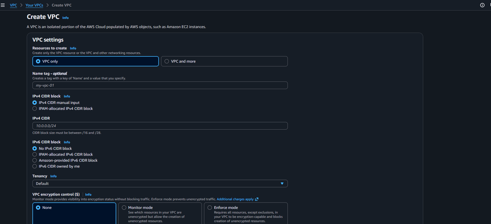
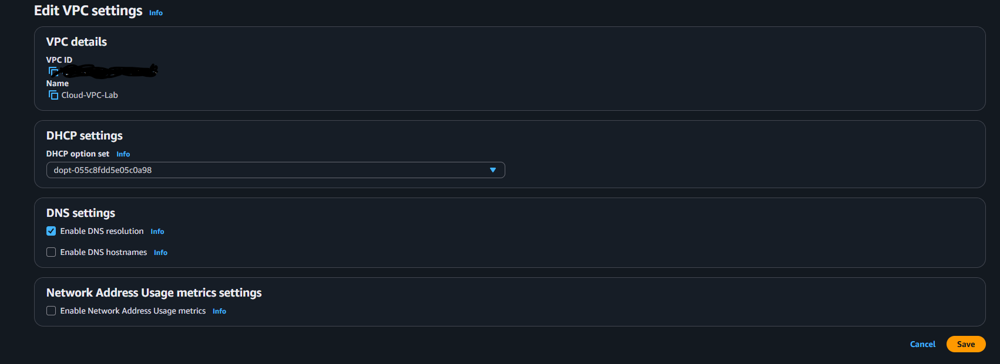

# aws-cloud-vpc-lab

Cloud networking is an important skill to have since many companies are shifting from on prem to to the cloud and knowing cloud architecture and networking helps with that.

# VPC

The first step is to to the VPC page in AWS and when there click on the create VPC button, then see this:   
    
Make sure to have the option as VPC only, then name it something like "Cloud-VPC-Lab". Then for the IPv4 CIDR put 10.0.0.0/16, turn on IPv4 CIDR, keep tenancy to default and then click on create. After a second, the VPC should be up.   
Then click on the actions tab and click on Edit VPC settings and see this:  
   
Then click on enable DNS hostnames and click on save.

# Subnets

After saving, go the left side of the page and click on subnets page and then click on Create a Subnet